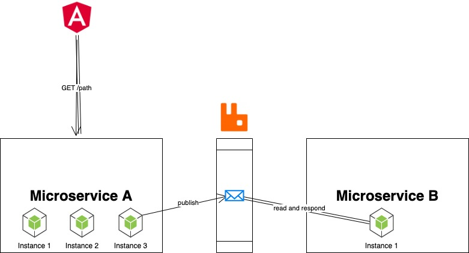

## Introduction

During a debugging session of one of our NodeJS microservices misbehaving on a Windows Server 2019 instances, I opened the microservice log to begin investigating the faulty behavior.

<!-- truncate -->

But when I scrolled down to the timestamp where I was supposed to start investigating, I found out that the log was full of the following errors thrown by an attempt to read the microservice log file:

```text
Error: EBUSY: resource busy or locked, lstat %PROGRAMDATA%/microservice_b/mb.log
```

Followed by a termination of the microservice logging. It was visible also that the microservice was in some unstable state as it's CPU was on 0% and it's memory working set was fixed and not changing.

After restarting the microservice (a NodeJS process wrapped in a Windows Service), the serverside functionality of the microservice resumed.

Since this microservice was critical to the functionality of the application, I needed to do 2 things, in this order:

- Ensure that there's no downtime for the microservice.
- Investigate the root cause of the `EBUSY` error.

## Microservice High Availability

High Availability is a concept that is synonymous with the microservice architecture. In a production-grade, enterprise environment, you want to have fault tolerance in case one of the microservices stops serving it's requests' path (as in the case I investigated here).

There are different approaches to fault tolerance, the most popular one is using replicas of the same microservices to listen on the same requests. For example, in the architecture I was working with, the Angular frontend application was sending requests to the NodeJS/Express servers who were talking between them in Produces/Consumer fashion using a RabbitMQ message broker. Each microservice (and its instances) was bound to one queue in an exchange.



The specific microservice that was malfunctioning had only one instance configured (Instance 1 of Microservice B in the diagram above). In order to provide High Availability in this case, all I needed to do was to find out how to increase the number of instances of a microservice.

Since the NodeJS microservices were deployed on a Windows instance and not in the newer generation Linux-cloud native instance which runs atop a Kubernetes cluster (where I could just run `kubectl scale deployment microservice_b --replicas=3`), I needed to check the configuration database (hosted as a Zookeeper instance) and find where we can configure the number of instance per microservice.

After a while of searching our knowledgebase (why are they always so messy and it's so hard to find anything in them?!?!), I found the z-node path where this configuation was held. I sent the following command to set the number of replicas to 3:

```bash
bin/zkCli.bat -server 127.0.0.1:2181 set /config/microservice_b/clusterNodes 3
```

First task was done. We now had 3 microservices and had High Availability for this critical service path. As you may recall, the next step was the investigation of the EBUSY event and mitigation of it.

## Investigating `EBUSY` Event

Until this point, I've been working on debugging NodeJS for about 1 year and mostly in a Windows environment. I have seen and debugged different NodeJS errors, such as filesystem-related `EACCES`, `ENOENT`, `EMFILE` and network-related errors `EADDRINUSE`, `ECONNRESET`, `ECONNREFUSED`, `ECONNABORTED` . But I've never seen `EBUSY` before.

First step was to see what the [official NodeJS documentation for error messages](https://nodejs.org/dist./v6.3.0/docs/api/all.html) provided. Not much elaboration from the site unfortunately:

> EBUSY | Indicates that a device or resource is busy.

Per my understanding, this issue was related to the filesystem mutex/lock.

I decided that the most efficient way to understand this error code was to review the NodeJS source code since, conveniently enough, is open-source.

I cloned the Node JS repo:

```bash
git clone https://github.com/nodejs/node.git
```

Took some time download and extract all of it.

I then searched through the source code and found the error code in 21 different files (filtering out all the test-related code):

```bash
grep -rnw "EBUSY" node | cut -d":" -f1 | grep -v test | uniq | wc -l
      21
```

After reviewing some files, I landed on `deps/uv/docs/src/loop.rst` where I found some document string of the method `Loop::uv_loop_close`:

```rst
.. c:function:: int uv_loop_close(uv_loop_t* loop)

    Releases all internal loop resources. Call this function only when the loop
    has finished executing and all open handles and requests have been closed,
    or it will return UV_EBUSY. After this function returns, the user can free
    the memory allocated for the loop.
```

I found it ironic how the source code is so much more elaborate than the official/external NodeJS documentation.

Also, I learned that .rst extension is a markup language format called [`reStructuredText` that is both human-readable and processable by Python `docutils`](https://en.wikipedia.org/wiki/ReStructuredText).

Going back to the task at hand, the method docstring was helpful in strengthening my educated guess that this issue is filesystem-related. It also provided information about the scenario when this error might occur: after a [NodeJS Event Loop](https://nodejs.org/en/docs/guides/event-loop-timers-and-nexttick/#:~:text=What%20is%20the%20Event%20Loop,the%20system%20kernel%20whenever%20possible.&text=js%20so%20that%20the%20appropriate,queue%20to%20eventually%20be%20executed.) has terminated and all open file handles I/O finished.

I decided to focus on the latter detail (file handle state) as I have some familiarity with the [Windows SysInternals binary called `handle.exe`](https://docs.microsoft.com/en-us/sysinternals/downloads/handle). It gives us access to information about which process has open file handlers to a specific file.

I need a way to fuse this Windows executable with the NodeJS code to catch the `EBUSY` event.

## Using Handle Binary in Microservice

I wrote a module called `checkFileHandler.js` which has two functions:

- `executeHandle` will execute the `handle.exe` binary.

- `getCmdArguments` will get the command-line arguments of the processes that handle captured using PowerShell.

```javascript
var exec = require('child_process').execFile;
const handleExecutablePath = "./handle64.exe"
const PID_REGEX = /pid: (\d{1,5})/mg;

executeHandle = (filename) => {

 exec(handleExecutablePath, [filename], (err, data) => {
 
  if(err && err.signal == null){
   logger.info(`No matching handles for '${filename}'`);
  } else {
   logger.error(`Couldn't run handler: ${JSON.stringify(err, null, 3)}`);
  }
  
  var output = data.toString();
  console.log(output);
  var matches = output.match(PID_REGEX);
  
  if (matches){
   
   logger.info(`Found ${matches.length} processes`);
   matches.forEach(match => {
    var pid = match.split(":")[1].trimLeft();
    getCmdArguments(pid); 
   })
  }
  
  
 })
}

getCmdArguments = (pid) => {
 
 var psCommand = `Get-WmiObject -Query \"SELECT CommandLine FROM Win32_Process WHERE ProcessID = ${pid}\" | Select-Object -ExpandProperty CommandLine`;
  
 exec("powershell.exe ", psCommand.split(" "), (err, data) => {
  
  if(err) throw err;
  
  if (data) {
   logger.info(`PID ${pid} command line arguments: ${data.toString()}`)
   // return data.toString();
  }
    
 })
 
}

module.exports = {

 executeHandle: executeHandle

}
```

I then loaded the module within the microservice application code (don't forget to backup the original code in a production environment!):

```javascript
var handler = require('checkFileHandler');
var logfile = "%PROGRAMDATA%/microservice_b/mb.log";


# ...
getData()
    .then(changeDataFormat)
    .then(storeData)
    .catch((e) => {
        if (e.code == 'EBUSY') {
            handler.executeHandle(logfile);
            process.exit(1)
        }
    })
```

So now, whenever getData function calls finish and the NodeJS Event Loop is terminated but the log file is still unaccessible, we're going to receive detailed information about which process and its commands are keeping the log file open. Since the process is now stuck, it would be best to just terminate it so that the microservice scheduler can create another clean instance of the NodeJS server.

I restarted the microservice for my code to be applied and patiently waited for the situation to arise again.
