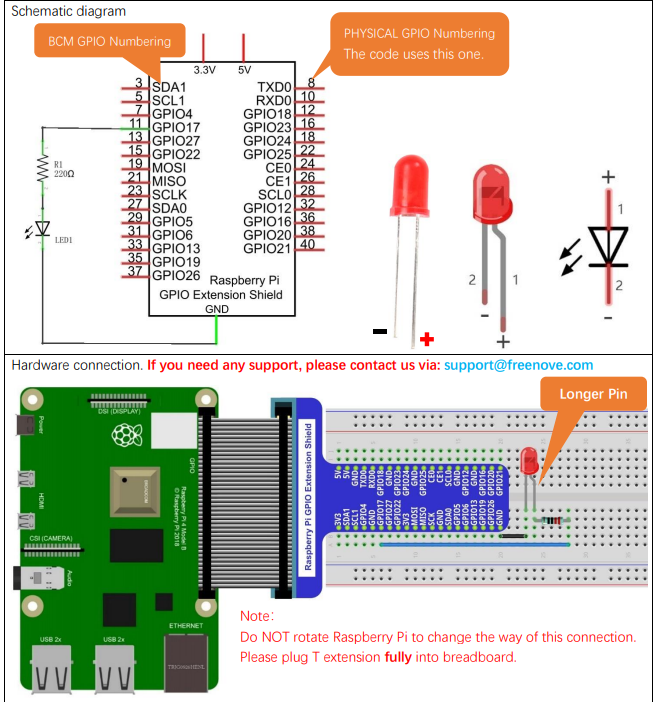

## Circuit



## Prerequistes

```bash
git clone https://github.com/WiringPi/WiringPi
cd WiringPi
./build
```

## Code

```c title=blink.c
#include <stdio.h>
#include <wiringPi.h>
#include <stdlib.h>
#include <signal.h>

// LED Pin - wiringPi pin 0 is BCM_GPIO 17.

#define LED 0

// Signal handler function
// Handle interrupt, set LED to LOW
void handle_interrupt(int signal) {
    printf("Interrupt signal caught. Exiting...\n");

    digitalWrite(LED, LOW);
    
    exit(0);
}

int main (void)
{
  printf ("Raspberry Pi blink\n") ;

  signal(SIGINT, handle_interrupt);

  wiringPiSetup () ;
  pinMode (LED, OUTPUT) ;

  for (;;)
  {
    digitalWrite (LED, HIGH) ; // On
    delay (500) ;  // mS
    digitalWrite (LED, LOW) ; // Off
    delay (500) ;
  }
  return 0 ;
}
```

### Execute

```bash
gcc blink.c -o blink -lwiringPi
WIRINGPI_DEBUG=1 ./blink
```
