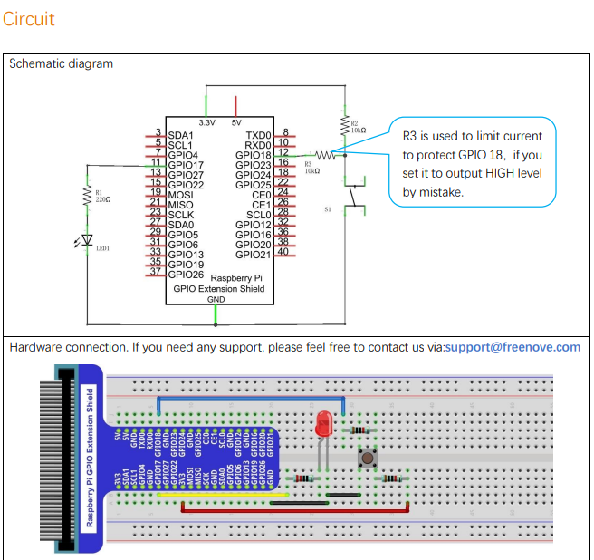

There are 3 essential parts in a complete automatic control device:

- INPUT: Buttons, switches, sensors, etc.
- OUTPUT: LED, buzzer, motor.
- CONTROL: RPi, Arduino, microcontroller.

This example explains how to build a simple control system of an LED using a push button switch.

## Circuit



## Code

### C

```c title=ButtonLED.c
#include <wiringPi.h>
#include <stdio.h>

#define ledPin    0   //define the ledPin
#define buttonPin 1  //define the buttonPin

void  main(void)
{
 printf("Program is starting ... \n");
 
 wiringPiSetup(); //Initialize wiringPi. 
 
 pinMode(ledPin, OUTPUT); //Set ledPin to output
 pinMode(buttonPin, INPUT);//Set buttonPin to input

 pullUpDnControl(buttonPin, PUD_UP);  //pull up to HIGH level
 while(1){
  if(digitalRead(buttonPin) == LOW){ //button is pressed 
   digitalWrite(ledPin, HIGH);  //Make GPIO output HIGH level
   printf("Button is pressed, led turned on >>>\n");  //Output information on terminal
  }
  else {       //button is released 
   digitalWrite(ledPin, LOW);  //Make GPIO output LOW level
   printf("Button is released, led turned off <<<\n");  //Output information on terminal
  }
 }
}
```

```bash
gcc ButtonLED.c -o ButtonLed -lwiringPi
```

### Python

```python title="ButtonLED.py"
#!/usr/bin/env python3
import RPi.GPIO as GPIO

ledPin = 11    # define ledPin
buttonPin = 12    # define buttonPin

def setup():
    
    GPIO.setmode(GPIO.BOARD)      # use PHYSICAL GPIO Numbering
    GPIO.setup(ledPin, GPIO.OUT)   # set ledPin to OUTPUT mode
    GPIO.setup(buttonPin, GPIO.IN, pull_up_down=GPIO.PUD_UP)    # set buttonPin to PULL UP INPUT mode

def loop():
    while True:
        if GPIO.input(buttonPin)==GPIO.LOW: # if button is pressed
            GPIO.output(ledPin,GPIO.HIGH)   # turn on led
            print ('led turned on >>>')     # print information on terminal
        else : # if button is relessed
            GPIO.output(ledPin,GPIO.LOW) # turn off led 
            print ('led turned off <<<')    

def destroy():
    GPIO.output(ledPin, GPIO.LOW)     # turn off led 
    GPIO.cleanup()                    # Release GPIO resource

if __name__ == '__main__':     # Program entrance
    print ('Program is starting...')
    setup()
    try:
        loop()
    except KeyboardInterrupt:  # Press ctrl-c to end the program.
        destroy()
```
