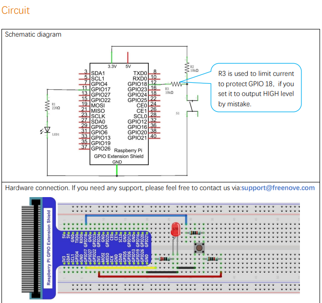

In this article, we're going to use a push button and an LED to build a tablelamp that turns on when pushed and turns off when pushed again.

## Circuit



## Code

### C

```c title=Tablelamp.c
#include <wiringPi.h>
#include <stdio.h>

#define ledPin    0   //define the ledPin
#define buttonPin 1  //define the buttonPin
int ledState=LOW;  //store the State of led
int buttonState=HIGH; //store the State of button
int lastbuttonState=HIGH;//store the lastState of button
long lastChangeTime; //store the change time of button state
long captureTime=50; //set the stable time for button state 
int reading;
int main(void)
{
 printf("Program is starting...\n");
 
 wiringPiSetup(); //Initialize wiringPi. 
 
 pinMode(ledPin, OUTPUT);   //Set ledPin to output
 pinMode(buttonPin, INPUT); //Set buttonPin to input

 pullUpDnControl(buttonPin, PUD_UP);  //pull up to high level
 while(1){
  reading = digitalRead(buttonPin); //read the current state of button
  if( reading != lastbuttonState){  //if the button state has changed, record the time point
   lastChangeTime = millis();
  }
  //if changing-state of the button last beyond the time we set, we consider that 
  //the current button state is an effective change rather than a buffeting
  if(millis() - lastChangeTime > captureTime){
   //if button state is changed, update the data.
   if(reading != buttonState){
    buttonState = reading;
    //if the state is low, it means the action is pressing
    if(buttonState == LOW){
     printf("Button is pressed!\n");
     ledState = !ledState; //Reverse the LED state
     if(ledState){
      printf("turn on LED ...\n");
     }
     else {
      printf("turn off LED ...\n");
     }
    }
    //if the state is high, it means the action is releasing
    else {
     printf("Button is released!\n");
    }
   }
  }
  digitalWrite(ledPin,ledState);
  lastbuttonState = reading;
 }

 return 0;
}
```

### Python

```python title="Tablelamp.py"
import RPi.GPIO as GPIO

ledPin = 11       # define ledPin
buttonPin = 12    # define buttonPin
ledState = False

def setup():    
    GPIO.setmode(GPIO.BOARD)         # use PHYSICAL GPIO Numbering
    GPIO.setup(ledPin, GPIO.OUT)     # set ledPin to OUTPUT mode
    GPIO.setup(buttonPin, GPIO.IN, pull_up_down=GPIO.PUD_UP)     # set buttonPin to PULL UP INPUT mode

def buttonEvent(channel): # When button is pressed, this function will be executed
    global ledState 
    print ('buttonEvent GPIO%d' %channel)
    ledState = not ledState
    if ledState :
        print ('Led turned on >>>')
    else :
        print ('Led turned off <<<')
    GPIO.output(ledPin,ledState)
    
def loop():
    #Button detect 
    GPIO.add_event_detect(buttonPin,GPIO.FALLING,callback = buttonEvent,bouncetime=300)
    while True:
        pass
                
def destroy():
    GPIO.cleanup()                     # Release GPIO resource

if __name__ == '__main__':     # Program entrance
    print ('Program is starting...')
    setup()
    try:
        loop()
    except KeyboardInterrupt:  # Press ctrl-c to end the program.
        destroy()
```
