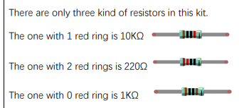
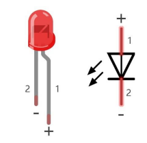

[Repo](https://github.com/Freenove/Freenove_Ultimate_Starter_Kit_for_Raspberry_Pi).

## Resistors

## LEDs

Since LEDs are diodes, it's important to know how much maximum current they can receive and to connect the right input and output electrodes.

In this kit, the longer pole is the positive electrode:

This is the recommended current for each:

| Color | V       | Max i (mA) | Recommended i (mA) |
|-------|---------|------------|--------------------|
| Red   | 1.9-2.2 | 20         | 10                 |
| Green | 2.9-3.4 | 10         | 5                  |
| Blue  | 2.9-3.4 | 10         | 5                  |